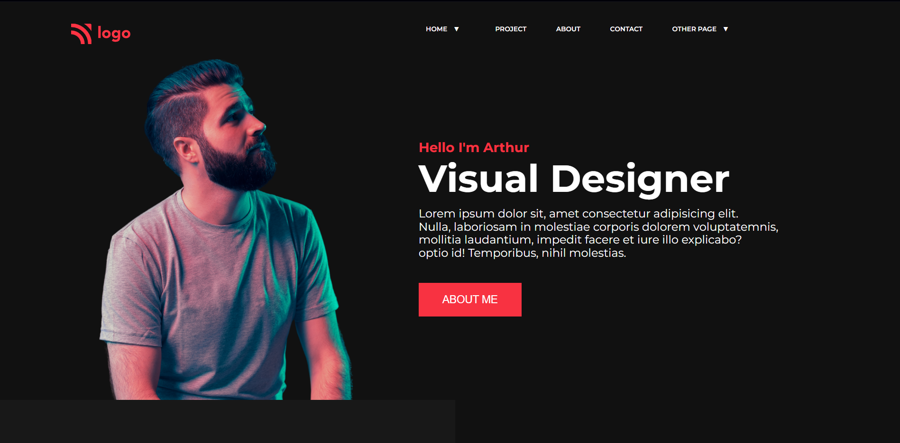

# Assignment 1

## Project 15 [Live Link](https://62e43860707898394ffe22cb--super-basbousa-6c93a7.netlify.app/)

- Skills Gained in this project
  - Learned to create background box for visual design.
  - Learned to use external fontawesome icon library
  - Gained indepth knowledge of flexbox.

---

## Time taken to finish this project

- Approximately 4-5 hour taken to complete this one.

#### Screenshot

